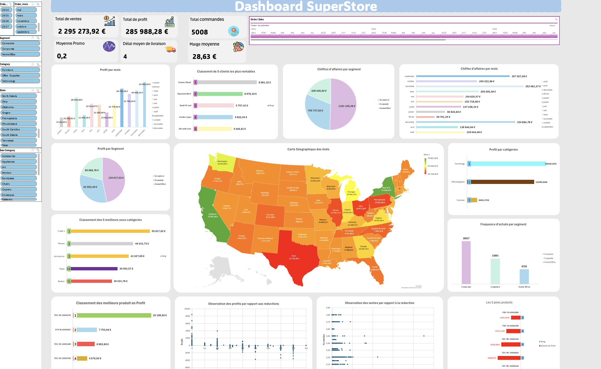

# 📊 Excel dashboard - Sales tracking

## 📝 Context
I carried out this project as part of the **‘12 Projects to become a Data Analyst ’** notebook offered by Natacha N. 
The aim was to create an **interactive Excel** dashboard to track a company's sales performance.

## 📈 Visual preview

## 🎯 Objective
Create a clear and interactive Excel **dashboard** that allows you to :
- Track overall **sales** and **margins**.
- Identify under-performing **regions or categories**.
- Enable **dynamic analysis** using filters and segments

## 📂 Database
[Superstore Dataset](https://www.kaggle.com/datasets/vivek468/superstore-dataset-final)

## ⚙️ Steps taken
1. **Data clean-up and preparation** 
   - Removal of duplicates, treatment of missing values  
   - Creation of calculated columns (Turnover, Margin, etc.)

2. **Analysis & processing in Excel**
   - Use of formulas: `SUM.IF`, `MOYENNE`, `RECHERCHEV`, `INDEX`, `EQUIV`, etc.
   - Creating pivot tables  
   - Add **segments** for dynamic filtering

3. **Dashboard creation**
   - Dynamic graphics (columns, bars, sectors)  
   - Clear organisation of KPIs  
   - Interactivity to facilitate decision-making

## 🧠 Skills developed
- Mastery of **DCTs (Dynamic Cross-Tabulations)**
- Automation via **advanced Excel formulas**
- Construction of **interactive dashboards**
- Data cleansing and organisation

## 🚀 To go further
This project can be transposed to **Power BI**, **Looker Studio**.

## 👥 Collaboration
Project carried out in partnership with [Desty MPASSI](https://github.com/DestyM)

## 👨‍💻 Author
[Alberto BONGUELE](https://github.com/GitAlberto)
